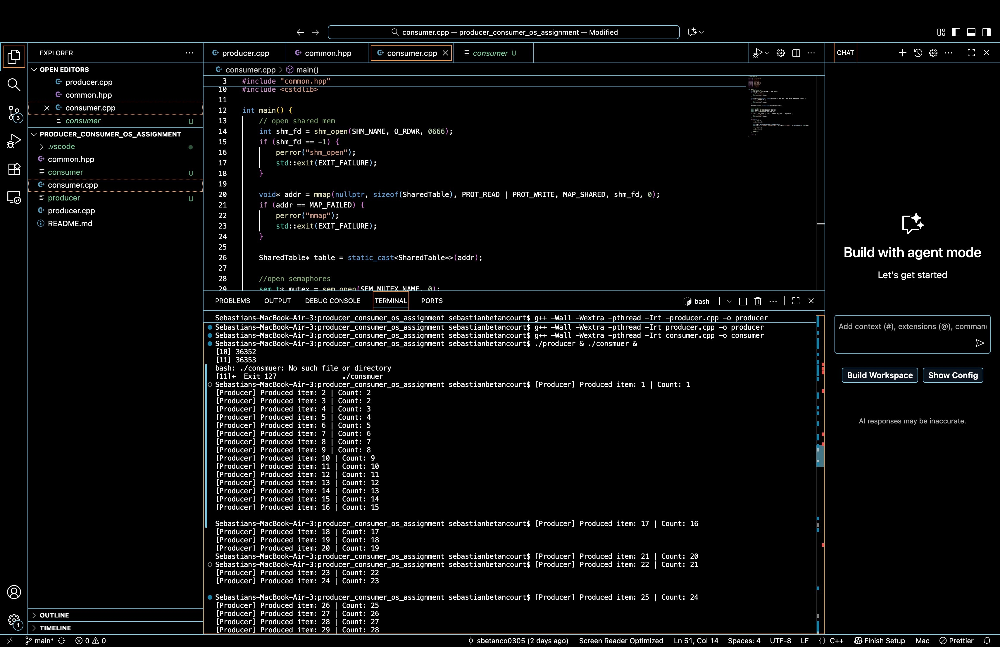

# producer_consumer_os_assignment
##Topic
**Producer-Consumer Problem**
The producer generates items and puts items onto the table. The consumer will pick up items. The table can only hold two items at the same time. When the table is completed, the producer will wait. When there are no items, the consumer will wait. We use semaphores to synchronize the producer and the consumer.

##Program description
Project consists of two programs: consumer.cpp and producer.cpp; I also designated some common shared resources in the common.hpp file

-The producer thread generate items and adds them into shared mem, the consumer thread 
-Then consumes or removes the items from the table.
-The table can store a maximum of two items at once. 
-The **Semaphores** ensure:
    -**Mutual Exlusion** with (sem_mutex) to access the table of shared mem; and 
    -**Counting Synchronization** with (sem_empty and sem_full) to keep track of slots. 
-The producer waits if the table is full for the consumer to retrieve an item. 
-**The shared memory** (/prodcons_shm) is used as a table accessed by both producer and consumer

Libraries used: 
* '<iostream>' - basic input output operations
* '<semaphore.h>' - for POSIX semaphores
* '<fcbtl.h>' - file control operations (required by shared mem)
* '<sys/mman.h>' - memory mapping 
* '<unistd.h>' - miscelaneous funcs (sleep)
* '<cstdlib>' - standard library funcs

Usage Instructions: 
**program compilation:** 
'''bash
g++ -Wall -Wextra -pthread producer.cpp -o producer
g++ -Wall -Wextra -pthread consumer.cpp -o consumer
**Run programs:**
./producer & ./consumer & 
("&" runs programs in background for concurrency)
**Terminate the programs: **
kill %1
kill %2
#or
killall producer
killall consumer

Examples & Results: 
Example Screenshot: 
                    
Producer producing text file: 
                    
Consumer consuming: Can't show an example because producer is the one who creates the semaphores therefore if I only execute the consumer nothing would happen. In other words, if there's nothing to be consumed, nothing will be consumed.